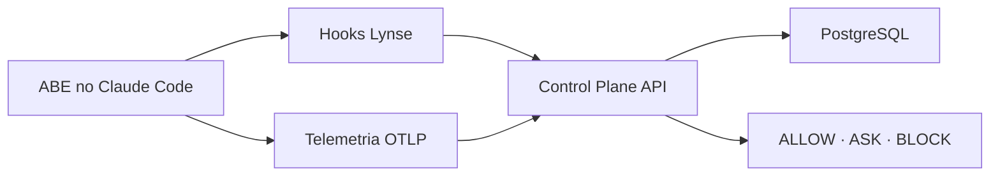

# Operação Lynse — Control Plane POC

POC executável do fluxo documentado no playbook **Operação Lynse**. Ela correlaciona uma User Story ao trabalho realizado no Claude Code e registra eventos, decisões de política, aprovações, telemetria, PRs e deploys.

## O que está incluído

- PostgreSQL 16 com schema e dados de demonstração;
- API HTTP do Control Plane em Node.js;
- receptor OTLP/HTTP JSON para métricas nativas do Claude Code;
- hooks de auditoria e enforcement;
- comandos `/lynse-start`, `/lynse-status`, `/lynse-approve` e `/lynse-finish`;
- SPEC de exemplo e regras operacionais em `CLAUDE.md`;
- testes unitários do Policy Engine, redação de segredos e parser OTLP;
- guia detalhado de configuração e roteiro de demonstração.

## Arquitetura em uma leitura



Os hooks respondem **o que aconteceu e se a ação pode ocorrer**. A SPEC informa **como o software deve ser construído**. O Control Plane cria a trilha que liga **User Story → sessão → prompts → ferramentas → código → PR → deploy**.

## Início rápido

Pré-requisitos: Docker Desktop ou Docker Engine com Compose, Node.js 20.12+ no computador do ABE e Claude Code instalado.

```bash
cp .env.example .env
cp .env.lynse.example .env.lynse
docker compose up --build -d
curl http://localhost:3333/health
chmod +x scripts/run-claude-lynse.sh
./scripts/run-claude-lynse.sh
```

Dentro do Claude Code:

```text
/lynse-start US-1842
```

Depois que o plano for apresentado:

```text
/lynse-approve plan Plano aderente à SPEC e aos critérios de aceite
```

Para consultar a execução:

```text
/lynse-status
```

Consulte [o guia de configuração](docs/CLAUDE_CODE_SETUP.md) antes da primeira demonstração.

## Estrutura

| Caminho | Responsabilidade |
|---|---|
| `database/` | schema e seed PostgreSQL |
| `src/server.mjs` | APIs, autenticação, ingestão OTLP e resumos |
| `src/policy-engine.mjs` | regras ALLOW, ASK e BLOCK |
| `.claude/hooks/` | integração automática com os eventos do Claude Code |
| `.claude/skills/` | comandos do ABE |
| `SPEC/` | padrões de arquitetura, segurança, testes e DoD |
| `docs/` | configuração, arquitetura, API e demonstração |

## Comandos de desenvolvimento

```bash
npm install
npm run db:setup
npm start
node --test
npm run check
```

O `docker compose up --build` já instala a dependência do serviço, aplica o schema, carrega o seed e inicia a API.

## Limites intencionais da POC

Esta versão é adequada para validar o processo, o modelo de dados e a integração. Antes de produção, separe tenants, use identidade corporativa no lugar da API key compartilhada, adicione TLS, fila de ingestão, retenção, criptografia, RBAC, observabilidade da própria plataforma e adapters reais de Jira/Azure DevOps, GitHub/GitLab e CI/CD.

