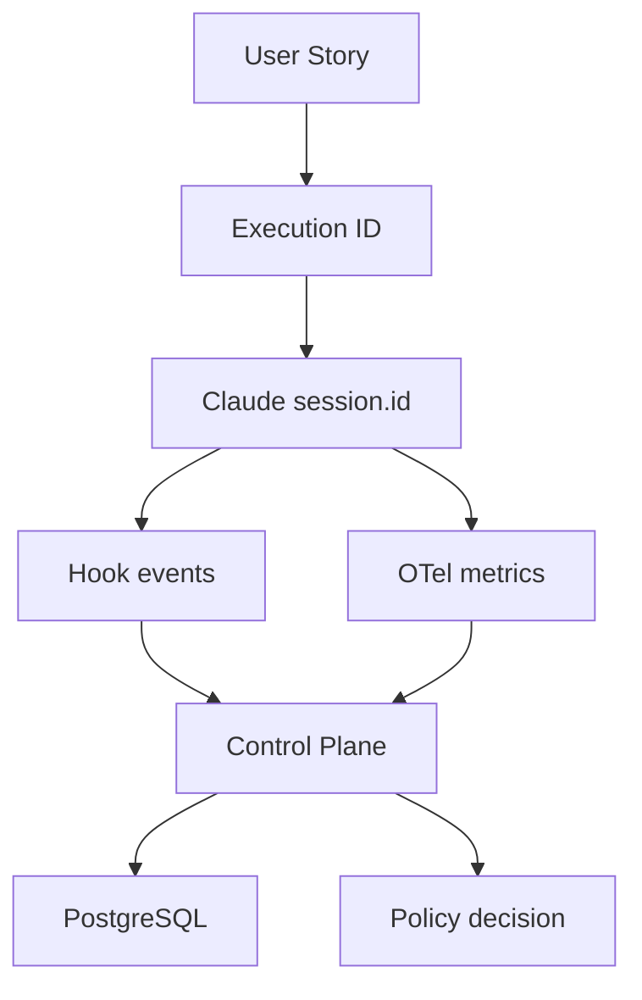
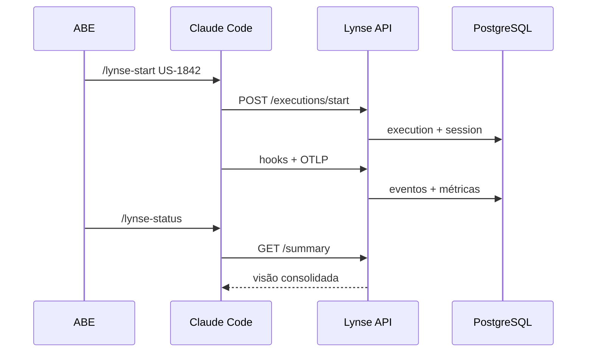

# Arquitetura da POC

## Objetivo

Transformar a sessão do Claude Code em uma execução rastreável da Operação Lynse, sem pedir ao ABE para contar tempo, tokens, chamadas ou alterações manualmente.

## Responsabilidade de cada componente

| Componente | Papel na POC | Evolução esperada |
|---|---|---|
| Hooks | Capturam prompts classificados, ferramentas, resultados, subagentes e fim de sessão; avaliam ações antes de executar | SDK de adapters por ferramenta |
| SPEC | Define arquitetura, segurança, testes e Definition of Done | SPEC por cliente/projeto, versionada |
| Control Plane | Correlaciona eventos, aplica políticas e expõe a visão da execução | Multi-tenant, RBAC, filas e policy-as-code |
| OTLP | Recebe tokens, custo, LOC, commits, PRs e sessões quando emitidos pelo Claude Code | Collector dedicado e data lake |
| PostgreSQL | Guarda a trilha transacional da POC | Particionamento, retenção e criptografia |
| ABE | Aprova plano, PR, deploy e exceções | Aprovações baseadas em risco |

## Correlação

O comando `/lynse-start US-1842` cria um `execution_id` e associa a ele o `${CLAUDE_SESSION_ID}`. Os hooks enviam ambos em cada evento. O Claude Code inclui `session.id` na telemetria OTLP; o resumo cruza essa sessão com a execução.

## Privacidade

O modo padrão é `classified`: prompts, parâmetros e resultados são representados por hash, tamanho, categorias e uma prévia já redigida. `metadata` remove a prévia. `full` guarda conteúdo redigido e truncado, devendo ser usado apenas com política explícita. A POC desativa, por padrão, logs OTLP com prompts, respostas e detalhes de ferramentas.

## Audit e enforcement

- `audit`: a política é registrada como `would_block`, mas a ação continua;
- `enforcement`: regras críticas retornam `deny`; regras de alto risco podem retornar `ask` para confirmação.

Comece em `audit`, analise falsos positivos e só então ative `enforcement` por projeto.

